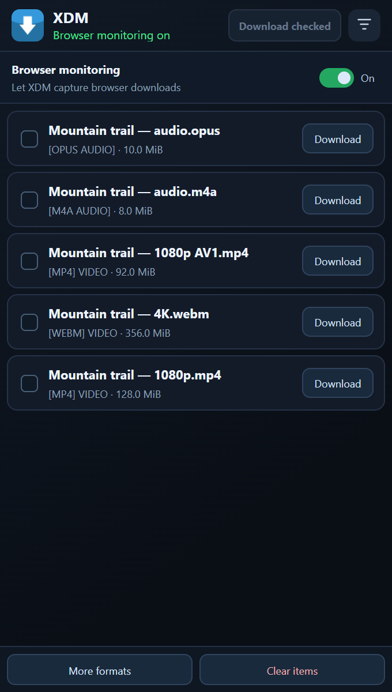
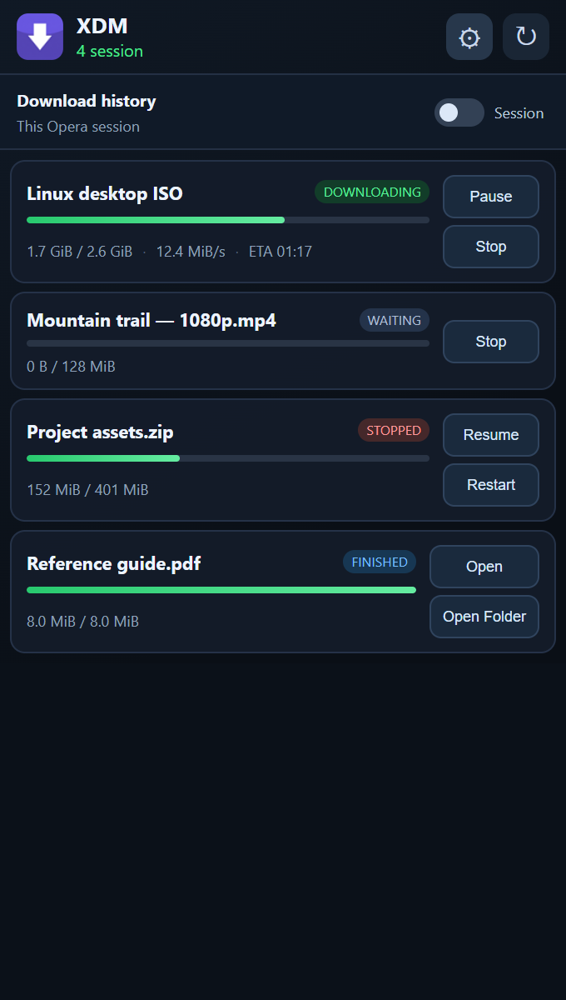
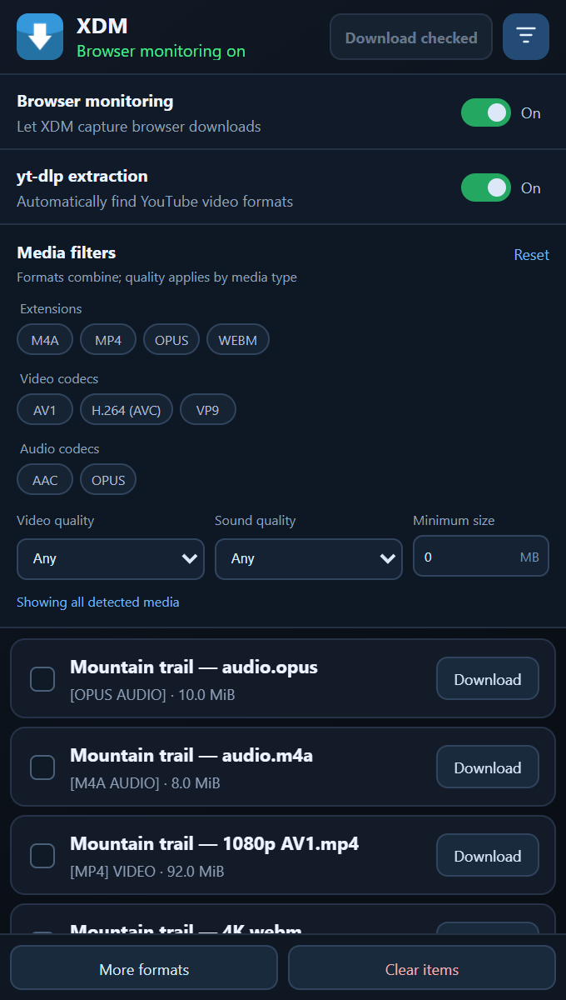

# XDM 9.0.2 Beta for Windows

Download files, capture streaming media, and manage your downloads directly from the browser. This Windows beta brings two complementary extensions, live download updates, better YouTube format discovery, and a rebuilt installer for both 32-bit and 64-bit Windows.

**[Download XDM-Setup.exe](https://github.com/dimitris-lagos/xdm/releases/download/v9.0.2/XDM-Setup.exe)** · **[Release notes](https://github.com/dimitris-lagos/xdm/releases/tag/v9.0.2)** · **[Upstream XDM](https://github.com/subhra74/xdm)**

## What's new

### Live downloads in your browser

The **Download Controller** now receives events directly from XDM through an authenticated local WebSocket. Starts, pauses, completions, and removals reach the toolbar and popup immediately, so a tiny download can finish between refresh intervals and still register correctly.

- The toolbar badge shows the number of active and queued downloads, then a completion checkmark.
- View progress, transferred size, speed, and remaining time without periodic download polling.
- Pause, stop, resume, or restart a download; open completed files or their containing folders.
- Switch between downloads from the current browser session and the complete XDM history.
- Reconnect automatically after XDM or the extension worker restarts. Ordered replay prevents duplicate processing; a fresh snapshot recovers the current state when replay is unavailable.

The backend retains the most recent 512 events. A snapshot can recover completed downloads still present in XDM, but events outside that window for entries that have already been removed cannot be reconstructed. Progress updates are limited to four per second per download; lifecycle events are not throttled.

### Find the media you actually want

The **Integration Module** captures browser downloads and lists detected video and audio formats. Its options panel helps narrow a long media list without leaving the page.

- Combine extension filters with video codecs, audio codecs, video quality, sound quality, and minimum size.
- Choose from detected codec families such as H.264, HEVC, AV1, VP9, AAC, and Opus.
- Select several formats and use **Download checked**, or download an individual item.
- Control regular browser monitoring and automatic **yt-dlp extraction** independently.
- Turn yt-dlp extraction off to stop automatic YouTube scans and cancel running extractors while ordinary browser downloads remain available.
- Repeated browser filename callbacks hand a download to XDM only once.

YouTube discovery follows tab navigation and uses structured format metadata. Codec and quality choices come from the formats XDM detects, rather than guesses based on a filename.

### Clean Completed

A new **Clean Completed** button sits in the desktop app's bottom bar, between the queue controls and Help.

It removes completed entries from the download list while keeping downloaded files on disk. A confirmation explains the action, and **Don't ask me again** remembers your preference across restarts. The button is disabled when there are no completed entries.

### One installer for both architectures

The new setup wizard selects x86 on 32-bit Windows and x64 on 64-bit Windows, with the matching application, guide, and native SQLite library.

- Separate yt-dlp and FFmpeg download options, with warnings for manual installation.
- Parallel media downloads with individual progress bars and SHA-256 verification.
- Actual Windows Installer progress, an optional desktop shortcut, and an explicit **Finish** button.
- Stable extension folders, so updates only require reloading the existing unpacked extensions.
- Personal download databases and settings stay outside the installer payload.

## The two extensions

| Integration Module | Download Controller |
| --- | --- |
| Captures browser downloads and discovers media on the page. | Shows and controls downloads already managed by XDM. |
| Browser monitoring, YouTube extraction, media filters, and multi-selection. | Live progress, toolbar counts, session/history scope, and download actions. |

<table>
  <tr>
    <th>Integration Module</th>
    <th>Download Controller</th>
  </tr>
  <tr>
    <td></td>
    <td></td>
  </tr>
</table>

  
<strong>Integration options and media filters</strong>

  

Screenshots use the shipped popup interfaces with illustrative sample data.

## Install and connect your browser

1. Download and run **XDM-Setup.exe**. Administrator rights and **.NET Framework 4.7.2 or newer** are required.
2. Keep the yt-dlp and FFmpeg options checked for the tested media tools. Selected downloads require internet access.
3. Click **Install**, then **Finish** to launch XDM.
4. In Opera, Chrome, Edge, or another Chromium browser, open the extensions page and enable **Developer mode**.
5. Use **Load unpacked** for each of these folders:

   - Integration Module: <code>C:\Program Files (x86)\XDM\chrome-extension</code>
   - Download Controller: <code>C:\Program Files (x86)\XDM\download-controller-extension</code>

6. Keep XDM running while using the extensions. After updating XDM, use **Reload** on both extensions. Remove previous unpacked copies to avoid multiple integrators capturing the same download.

The Download Controller requires **Chromium 116 or newer**. Its connection is restricted to the fixed extension identity and a process-scoped session token. Browser communication stays local at <code>127.0.0.1:8597</code>.

### YouTube prerequisite

For full YouTube support, install **Deno 2.3.0 or newer** from the [official Deno repository](https://github.com/denoland/deno), then restart XDM. The first installation guide also explains this requirement.

### Tested media versions

| Tool | Pinned version |
| --- | --- |
| yt-dlp | 2026.08.19 |
| FFmpeg | N-127043-g5a54fcf75e-20260930 |
| FFmpeg release | autobuild-2026-09-30-18-57 |

Setup downloads the matching OS architecture from fixed upstream release URLs and verifies SHA-256 hashes. Media executables are not embedded in the installer. Unchecking a media option lets you install the tested version manually; newer versions have not been verified by this release.

Versions, URLs, and checksums are recorded in [release-config.json](app/XDM/release-config.json).

### Silent installation

~~~powershell
XDM-Setup.exe /quiet /norestart /log setup.log
~~~

Both media tools download by default. Optional switches:

| Switch | Effect |
| --- | --- |
| /skip-yt-dlp | Skip the yt-dlp download. |
| /skip-ffmpeg | Skip the FFmpeg download. |
| /no-desktop-shortcut | Omit the desktop shortcut. |
| /no-launch | Do not launch XDM when installation finishes. |

Download or checksum failures stop setup before Windows Installer runs.

### Your data

Download databases and preferences remain in <code>%USERPROFILE%\.xdm-app-data</code>. The installer stages an explicit runtime allowlist and never packages personal data.

<code>System.Data.SQLite.dll</code> is the managed provider. Its matching <code>x86\SQLite.Interop.dll</code> or <code>x64\SQLite.Interop.dll</code> is a native dependency, not a second download database.

## Build and release

Requirements: Windows, .NET SDK 5.0.416 with the .NET 5 test runtime, Node.js supporting <code>node --test</code>, and GitHub CLI for publishing. Pinned build/test media, WiX, and the offline NuGet feed are in [release-assets](app/XDM/release-assets).

From the repository root:

~~~powershell
# Build both architectures; verify media, SQLite, and regression tests.
.\app\XDM\scripts\build-exe.ps1

# Package verified outputs into the installer.
.\app\XDM\scripts\build-installer.ps1

# Run the full pipeline without pushing or publishing.
.\app\XDM\scripts\release.ps1 -DryRun

# Publish committed release inputs to the configured fork.
.\app\XDM\scripts\release.ps1
~~~

Update [release-config.json](app/XDM/release-config.json) and [release-notes.md](app/XDM/release-notes.md) before publishing. Generated builds stay in <code>app/XDM/obj/release</code>; installer outputs and checksums stay in <code>app/XDM/dist</code>. Packaging refuses stale or unverified builds.

<code>cleanup-xdm.ps1</code> previews stale files; <code>-Apply</code> removes them. <code>install-current.ps1</code> installs the built EXE from an elevated shell and checks installed hashes and unchanged personal data.

## About this fork

This release continues the Windows .NET implementation of [Xtreme Download Manager](https://github.com/subhra74/xdm), originally created by Subhra Das Gupta. Earlier Java releases and their cross-platform build instructions remain available in the upstream project.

XDM is licensed under the [GNU General Public License](LICENSE). Bundled build dependencies retain their respective licenses; see the archives and packages in <code>release-assets</code>.
